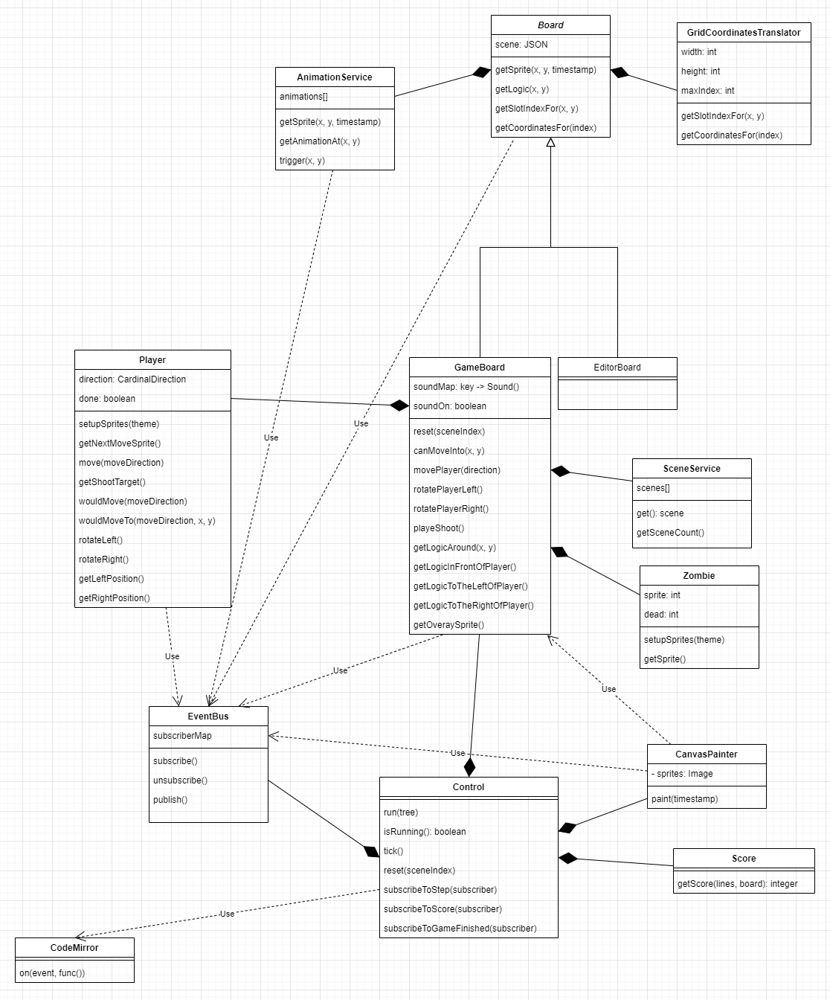
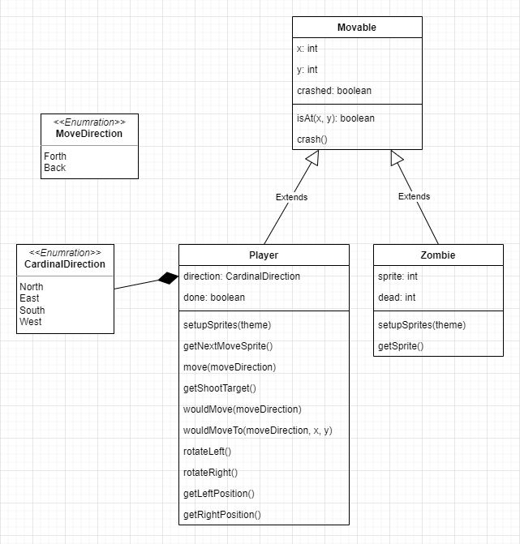

# SiDiLa

## Technical documentation

### Core classes

### Movables

### Events

The [EventBus](../src/util/event-bus.js) class implements the message broker role in a publisher-subscriber pattern.
To see which channels exist take a look to the [Event](..\src\game\event.js) class.